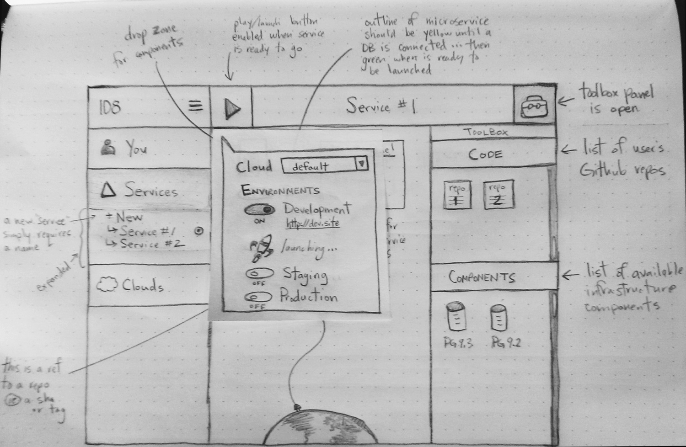
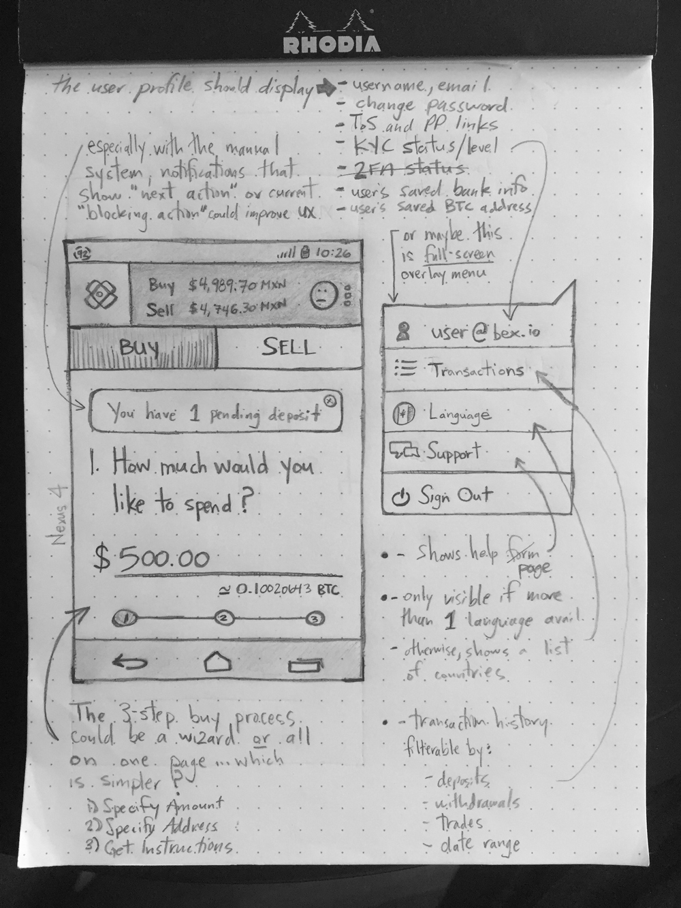

So, I've created an [OKR](https://7geese.com/okrs/) for my Q3 at [7Geese](http://7geese.com), <strong>"Improve my ability to think critically about feature design/implementation and strengthen user empathy through sketching" <a href="#footnote-1" style="text-decoration:none;">*</a></strong>, and tagged it with the <code class="learn-and-grow">Learning and Growth</code> label.
  
I've been meaning to get back to sketching UI and UX workflow ideas for a while now.  It's a great way to brainstorm and explore ideas _away from the computer_ for several reasons:

* it's the fastest/cheapest way to ideate and explore a few trains of thought quickly
* thinking with your hands and physical tools like pencil and paper provide a nice change in pace from digital tools
* sketching is low fidelity, which tends to invite commentary and foster better conversations around the ideas being presented

Finally, with so many interesting things on the 7Geese feature roadmap, this will be a useful way jot down some ideas before we form teams and start building things.

    <strong class="pull-left" style="margin-right:10px;">*</strong>
    
My objective was previously called "12 sketches in 12 weeks", but I improved it after watching [Creating a GREAT OKR and Quarterly Planning Process](https://vimeo.com/133095368)

    sketches from past projects

