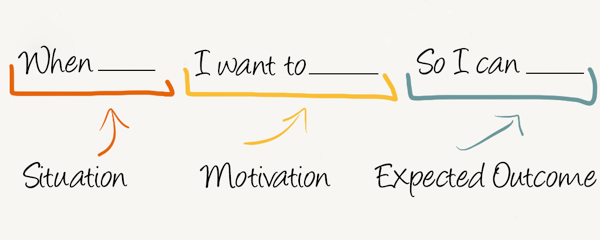

<blockquote>
    **Information Architecture (IA)** is... um, a lot of things.  
    
– me, paraphrasing _Wikipedia_

</blockquote>

For the purposes of this exercise, I think it's fair to classify "information architecture" as the organization, labeling, navigation system, and layout of a web application to better support its usability and key workflows.

#### Design Constraints

In order to tame the infinite possibilities of this design, we came up with some constraints to better frame the problem we're trying to solve.  This will also help to measure if new designs have been successful.

_Target Roles:_ Team Member, Manager (2 of the [4 roles](https://7geese.atlassian.net/wiki/display/PD/Compiled+Workflows) we've defined)  
_Typical Example Network:_ We're imagining that this design is targeted at a company with 50+ employees that has departments set and runs performance management processes (which were set up at least 6 months ago) using 1 or more of 7Geese's core features.  
_Ultimate Goal:_ Better enable users to succeed with their company's performance management process.  
_Execution Time:_ The new design should be able to be implemented by the dev team within a 3-month timespan.

#### "My Daily Routine with 7Geese"

That was the title of a blog post I was working on before the IA project came to be.  The idea emerged during a chat with Max at one of our front-end meetings where we asked: "Why doesn't 7Geese just tell me what to do, or at least where to start?"

Ultimately, it's the same question we're asking in this project: "How can we help users be successful with their company's PM process?"

That's a great start, but what could that look like?  Could 7Geese generate relevant, actionable TODO lists based on a user's activity and position in the org chart?  Maybe we could set up scheduled [alerts](http://sketches.kevinsalter.me/articles/2-1-on-1-alert/) that remind users at certain times to give certain tasks attention?  Would a "follow model", à la Twitter, help users focus on messages and notifications they care about, and ignore information that is irrelevant?

My favourite idea that's been suggested so far is that the homepage could function more as a customized user dashboard.  A lot of information is duplicated between the Cycles page, Profile page, and the current Homepage.  That information could be more relevantly arranged in a way that's not only informational, but actionable as well.  Personally, this will by the root of my first concepts presented here.

#### Job Stories

I used the [job stories](https://blog.intercom.io/using-job-stories-design-features-ui-ux/) paradigm as one technique to channel my thinking throughout this process of exploring the context, causality, anxieties, and [motivations and forces](https://medium.com/the-job-to-be-done/5-tips-for-writing-a-job-story-7c9092911fc9#21ab) of what 7Geese users do now.  Also, I thought that if some of these designs were successful, this pattern might make them [easier to test](https://robots.thoughtbot.com/test-driven-product-design) later on.

    As a quick reminder, this is the anatomy of a typical Job Story.

##### Role: Team Member

- When I log in to 7Geese I want to know which objectives haven't been assessed within the last 2 weeks so I can tend to them by checking in and updating their assessment status.
- When I log in to 7Geese I want to know if I have a scheduled 1-on-1 coming up that I haven't prepared for so I can set aside time to prepare for it.

##### Role: Manager

- When I log in to 7Geese I want to know how my reports are progressing with their OKRs in case I should reach out and ask if they need help.
- When viewing a list of my reports I want to know who has scheduled and/or prepared their next 1-on-1 and if not, send them a reminder.

As always, [leave a comment below if something comes to mind!](#disqus_thread)

#### Appendix A: _the cutting room floor_

There's another idea that is a bit too abstract to pursue, but I think is interesting to mention.

The idea is that a user would have an interactive, customizable sub-set of the org chart that they would visually arrange in a way that's relevant to them. It would actually be like a combination of Google+ circles and a follow model, essentially adding the ability to group people like others in your department, your reports, who you report to, who you're collaborating with on specific OKRs, etc.  Finally, the visual arrangement of these groups would serve as a kind of custom org chart, and could also possibly affect the types of notifications a user receives regarding things like feedback requests, 1-on-1 reminders, department level OKR updates, etc.

Again, this is likely more on the impractical side, but cool to imagine.  It's also harder for me to relate to this concept because it doesn't apply to companies as small as 7Geese, so it's harder to reason about pragmatically.

    user dashboard concept

