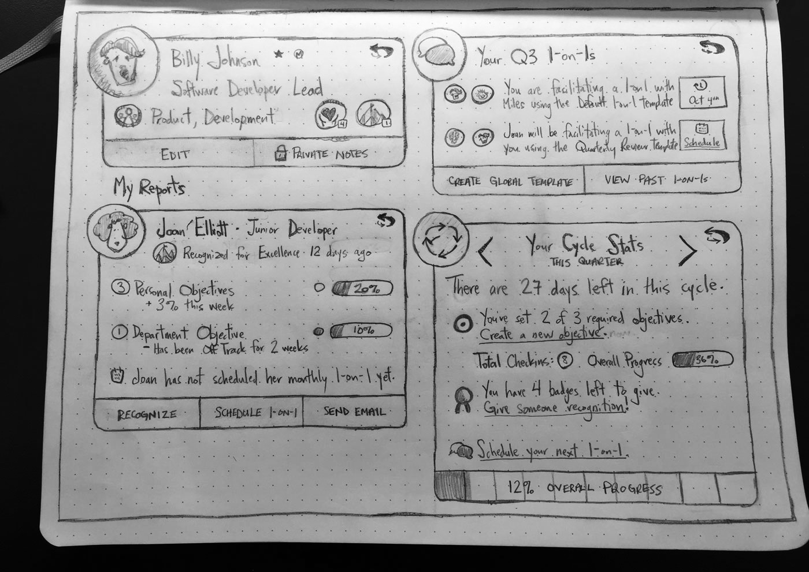
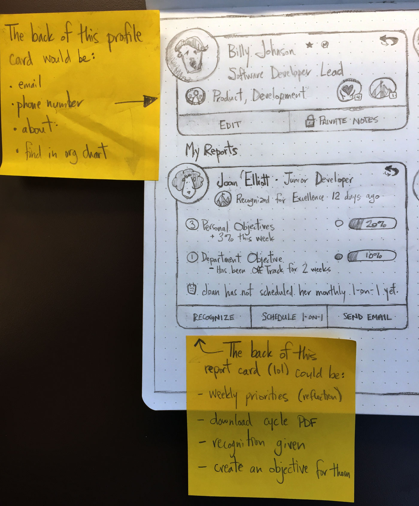
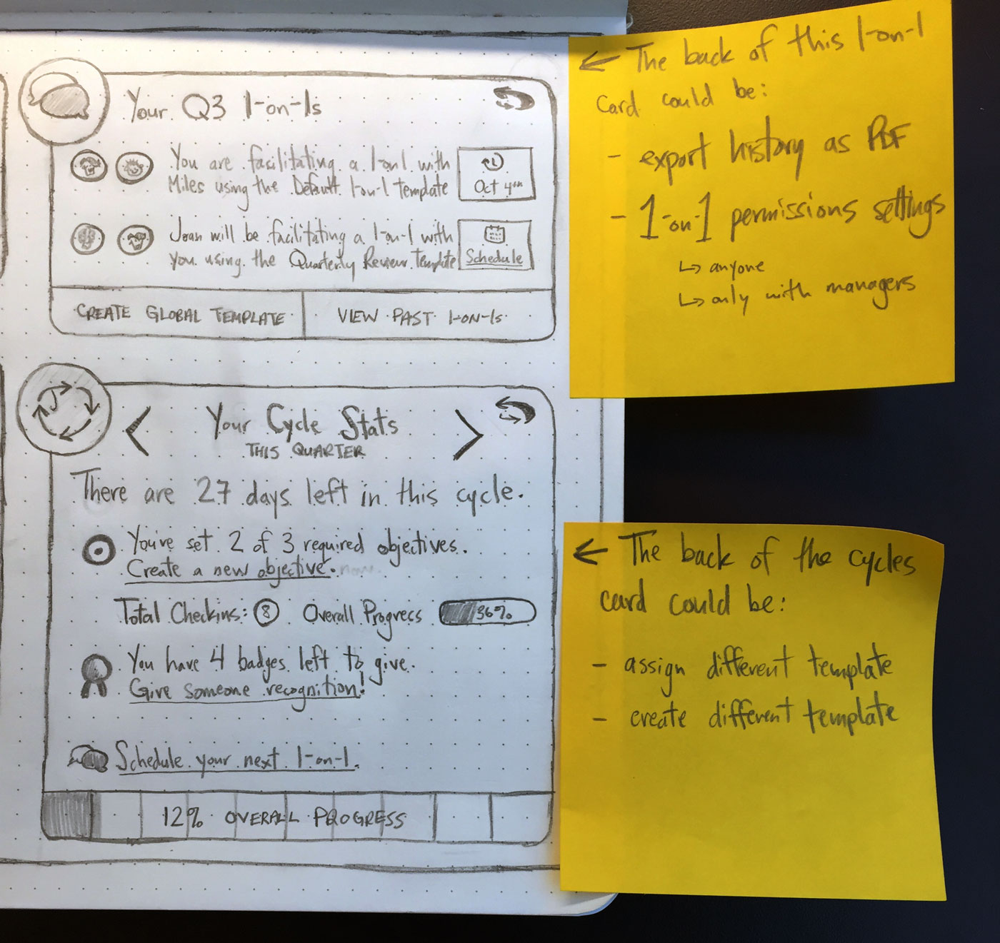

<blockquote>
    **Information Architecture (IA)** is... um, a lot of things.  
    
– me, paraphrasing _Wikipedia_

</blockquote>

For the purposes of this exercise, I think it's fair to classify "information architecture" as the organization, labeling, navigation system, and layout of a web application to better support its usability and key workflows.

#### Design Constraints

In order to tame the infinite possibilities of this design, we came up with some constraints to better frame the problem we're trying to solve.  This will also help to measure if new designs have been successful.

_Target Roles:_ Team Member, Manager (2 of the [4 roles](https://7geese.atlassian.net/wiki/display/PD/Compiled+Workflows) we've defined)  
_Typical Example Network:_ We're imagining that this design is targeted at a company with 50+ employees that has departments set and runs performance management processes (which were set up at least 6 months ago) using 1 or more of 7Geese's core features _(OKRs, Cycles, Recognition, Feedback, 1-on-1s)_.  
_Ultimate Goal:_ Better enable users to succeed with their company's performance management process.  
_Execution Time:_ The new design should be able to be implemented by the dev team within a 3-month timespan.

#### "My Daily Routine with 7Geese"

That was the title of a blog post I was working on before the IA project came to be.  The idea emerged during a chat with Max at one of our front-end meetings where we asked: "Why doesn't 7Geese just tell me what to do, or at least where to start?"

Ultimately, it's the same question we're asking in this project: "How can we help users be successful with their company's PM process?"

That's a great start, but what could that look like?  Could 7Geese generate relevant, actionable TODO lists based on a user's activity and position in the org chart?  Maybe we could set up scheduled [alerts](http://sketches.kevinsalter.me/articles/2-1-on-1-alert/) that remind users at certain times to give certain tasks attention?  Would a "follow model", à la Twitter, help users focus on messages and notifications they care about, and ignore information that is irrelevant?

My favourite idea that's been suggested so far is that the homepage could function more as a customized user dashboard.  A lot of information is duplicated between the Cycles page, Profile page, and the current Homepage.  That information could be more relevantly arranged in a way that's not only informational, but actionable as well.

Personally, this will by the root of my first concepts presented in the sketches here – the idea that the cycles and profile pages are gone, and the user dashboard is the new homepage (and where you would view someone else's cycle, for example).  I'm also choosing to leave the navigation as it is because I feel changing it would be too drastic given the design constraints.  So you can imagine the sketches below as having the current navigation above them.

Another design decision I made for the sketches is the use of the [cards](https://blog.intercom.io/why-cards-are-the-future-of-the-web/) design pattern.  I decided it would help me to focus if I just made a call and had that be clear from the outset.  This helped to divide the main features into composable modules, such as:

<ul style="column-count: 2; -webkit-column-count: 2; -moz-column-count: 2;list-style: none">
    <li>• Profile card</li>
    <li>• Recognition card</li>
    <li>• 1-on-1 card</li>
    <li>• Feedback card</li>
    <li>• Objectives card</li>
    <li>• My Impact card</li>
    <li>• Reflection card</li>
    <li>• Cycles Stats card</li>
    <li>• Department cards</li>
    <li>• Reports card</li>
    <li>• Feed/Notification cards</li>
</ul>
 
#### Job Stories

Before sketching any wireframes, I used the [job stories](https://blog.intercom.io/using-job-stories-design-features-ui-ux/) paradigm as one technique to channel my thinking throughout the process of exploring the context, causality, anxieties, and [motivations and forces](https://medium.com/the-job-to-be-done/5-tips-for-writing-a-job-story-7c9092911fc9#21ab) of what 7Geese users do now.  This paradigm is equally important in helping to avoid focusing on useless items such as assumptions, subjectiveness, personas, and implementations _before putting pen to paper_.  Finally, I thought that if some of these designs were successful, this pattern might make them [easier to test](https://robots.thoughtbot.com/test-driven-product-design) later on.

    As a quick reminder, this is the anatomy of a typical Job Story.

##### Role: Team Member

- When I log in to 7Geese...
    - ...I want to know which objectives haven't been assessed within the last 2 weeks so I can take action by checking in and updating their assessment status.
    - ...I want to know if I have a scheduled 1-on-1 coming up that I haven't prepared for so I can set aside time to prepare for it.
    - ...I want to clearly see my progress on cycle requirements because I'm concerned that I won't meet my quarterly quotas and I'm concerned that my manager and teammates will see that my objectives are Off Track.
    - ...I want to see how the progress I have made so far this quarter has contributed to Department and Organizational level OKRs because I want myself and my colleagues to understand and recognize how I'm contributing to the bigger picture.

- When viewing a list of my teammates...
    - ...I want to see how their updates and how their progress is trending because I want to see if I can support them in their tasks and/or I want to recognize them if they've done something exceptional.

##### Role: Manager

<blockquote style="font-size: 16px;">
_note: Since a Manager is also a Team Member, these job stories essentially extend those listed above, so I won't duplicate them here._
</blockquote>

- When I log in to 7Geese...
    - ...I want to know how my reports are progressing with their OKRs in case I should reach out and ask if they need help because I want them to be engaged and On Track.

- When viewing a list of my reports...
    - ...I want to know who has scheduled and/or prepared their next 1-on-1 and if not, send them a reminder.
    - ...I want to see who hasn't been recognized in a while because I want to make sure I'm recognizing reports who deserve it, or I want to encourage reports who could step up their game.
    - ...I want to see which reports have or have not scheduled and/or prepared their monthly 1-on-1 so I can remind them to do so, or offer assistance if they need it.

As always, [leave a comment below if something comes to mind!](#disqus_thread)

    user dashboard cards concept - profile, my reports, 1-on-1s, cycles

    profile and my reports cards with notes

    1-on-1s and cycles cards with notes

    "my impact" card concept

    [feed](http://sketches.kevinsalter.me/articles/6-feed-me/) card concept

