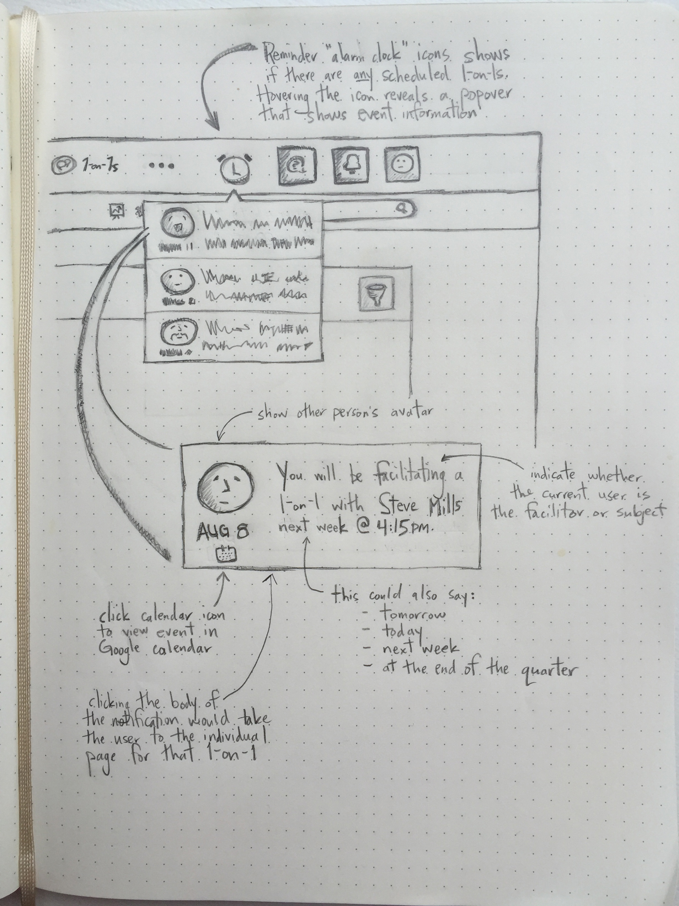

This quick sketch was inspired by the upcoming 1-on-1 scheduling project for 7Geese, and also the proposed "Explore new Information Architecture (IA) approaches for 7Geese" project.

#### Overview

The idea of the platform shifting from being objective oriented (lol... no? ...) to being focused on talent management and employees (as proposed in the IA project definition) is actually quite profound.  To me, at the highest level, it's the difference between whether I keep the 7Geese application open in a browser tab all day, every day, or only open it once a week to check into my objectives.  Huge difference.

To expand on that, if the application is going to be open all the time, it will be because it's giving me new and direct feedback.  As a user, I'll then want to treat the app as a dashboard for project related progress.

> - How is my team doing, especially on the projects I'm directly involved in?
> - Where am I needed?
> - What should I do next?

Answering these questions for users could improve a couple of the answers that Dave recently received from users to the question [Can you tell us why you checked-in today?](https://7geese.atlassian.net/wiki/pages/viewpage.action?pageId=12714000).

#### 1-on-1 Alert

In a culture of Continuous Performance Management, the habit of regular 1-on-1s is vital.  Furthermore, if you have a management role, this can involve participating in different 1-on-1s as both a facilitator and subject.  The case can then be made for the value of having a prominent alert that keeps the user engaged in the 1-on-1 workflows within 7Geese.

The top-right area of the navigation seems like a logical place for an alert like this to live since it would be close to other in-app notifications.  Inside the popover the user is presented with a concise, plain English representation of their pending 1-on-1 commitments (basically, any 1-on-1s that are in Draft Mode for that user).  There are two possible actions that can be performed on each list item:

1. click the calendar icon to go directly to Google calendar
2. clicking the body of the message would redirect the user to the individual page for that particular 1-on-1.

    scheduled 1-on-1 alert concept

