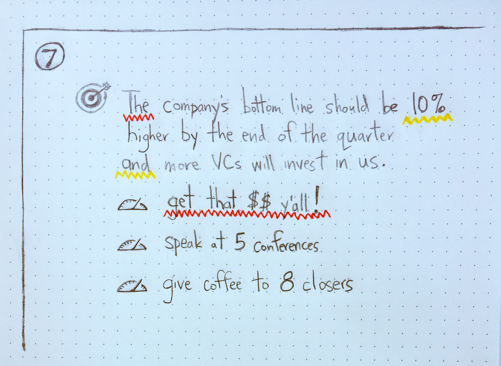
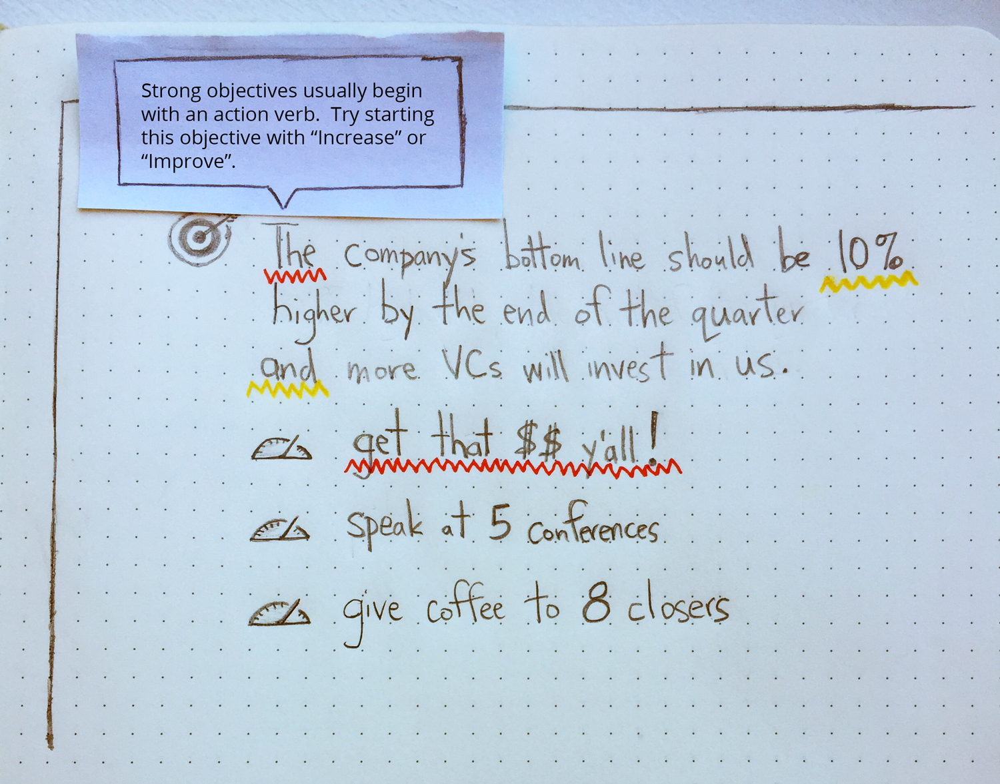
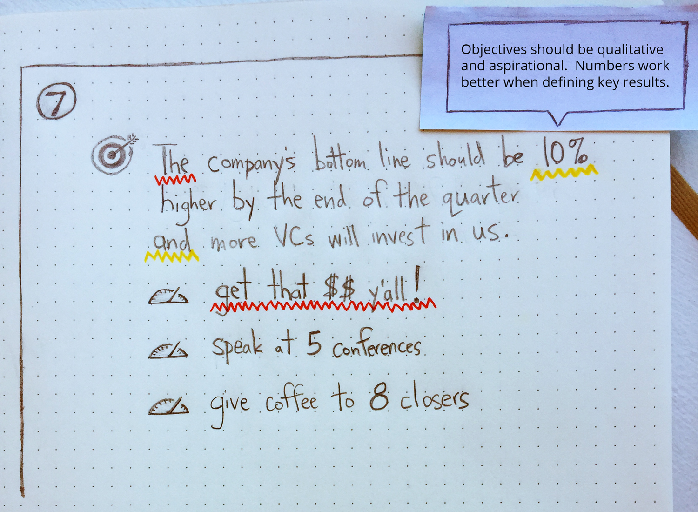
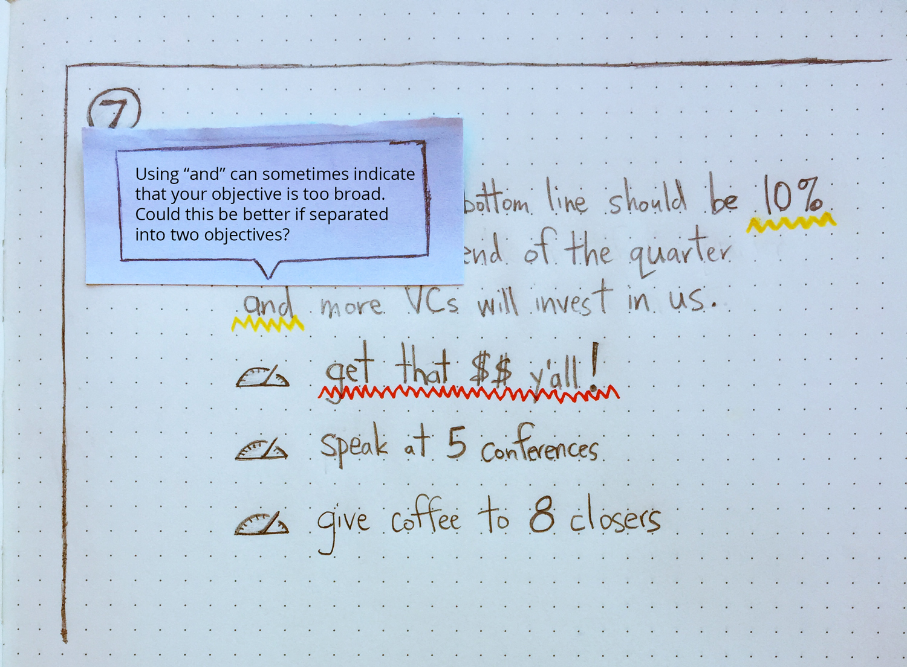
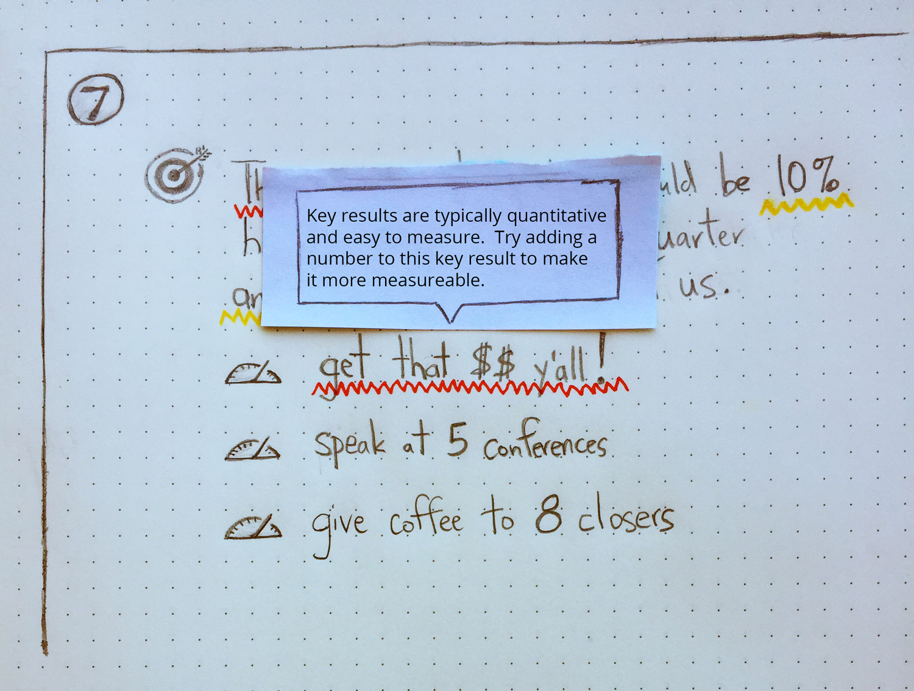

This week's sketch and concept started out as something I just thought would be funny– the idea that as you enter your objectives and key results into fields in the UI, the software "lints" your input and gives you feedback akin to a spell-checker.  But in the end, I realized that it actually has a couple of interesting connections to how a tech product delivers core value.

<span class="more"></span>

More on that in a minute, but first:

#### OKR Builder (and linter) Concept

This is really conceptual, since a good OKR has so many subjective qualities (i.e. it's difficult to algorithmically determine if an objective is "attainable, but still ambitious like a stretch goal" or if it aligns with a company's "organizational culture").  Then again, if I'm using the spell-checker analogy, a spell-checker can't ensure your writing is grammatically correct and elegant, so it kind of works.

In the sketches below, the interface is essentially a blank screen (à la Medium) with a field for the user to enter their first objective.  The user would press `<tab>` to jump from the objective to each key result, with new fields appearing as the user progresses (so, ideally no clicking would be required to create 3 objectives with 3 key results).  As the user types, the words are scanned on every keystroke, and feedback is given to the user based on what they've entered.

For example, I've noticed that 99% of objectives that I've seen defined in the OKR pattern begin with a verb (i.e. Increase, Reduce, Improve, Implement, etc.), so that would be helpful feedback to show the user.  For key results, the possibilities might be even more numerous considering they're more quantitative in nature.  In fact, most key results contain numbers, which is another data-point that an OKR builder could look for in the user's input.

_**Note:** the example OKR in the sketches below is completely contrived (obvs), and only intended for demonstration purposes._

Also, if I were to imagine a set of OKR linting rules as a config file similar to those we use in code linters, it might look something like this, `okr-linter.json`:

```
{
    "no_leading_verb_in_objectives": {
        "level": "error"
    },
    "numbers_in_objectives": {
        "level": "warn"
    },
    "too_many_ands_in_objective": {
        "level": "warn"
    },
    "no_numbers_in_keyresults": {
        "level": "error"
    }
}
```

#### Connecting Some Dots

One of the largest challenges at any tech company is onboarding.  And, when it comes to the [leading causes of churn in SaaS products](http://blog.preact.com/saas-churn-causes-and-prevention), it's often a huge factor.  At 7Geese it's especially interesting since we're also selling our customers on the adoption and implementation of the OKR methodology, as well as the software platform.

Another challenge that any tech company faces is forming some kind of "growth hacking" strategy.  For example, Facebook used the metric of getting users to "10 friends in 14 days" as a benchmark for deciding if users were adequately engaged with the product and would receive enough of the core value of the product to a level where they would be retained.

So, to combine those ideas, imagine this OKR builder tool were set up in such a way that it required the user to create "3 objectives with 3 key results every 3 months", and then guided the user through the process with automatic, instant feedback. 💥

That's obviously an over-simplification, but it's food for thought.

<p class="article-end"></p>

<span class="annotation">
    okr builder concept
</span>

<hr>
<span class="annotation">
    'objective starts with a verb' error tooltip
</span>

<hr>
<span class="annotation">
    'objective contains a number' warning tooltip
</span>

<hr>
<span class="annotation">
    'objective's scope is possibly too broad' warning tooltip
</span>

<hr>
<span class="annotation">
    'key result doesn't contain a number' error tooltip
</span>

