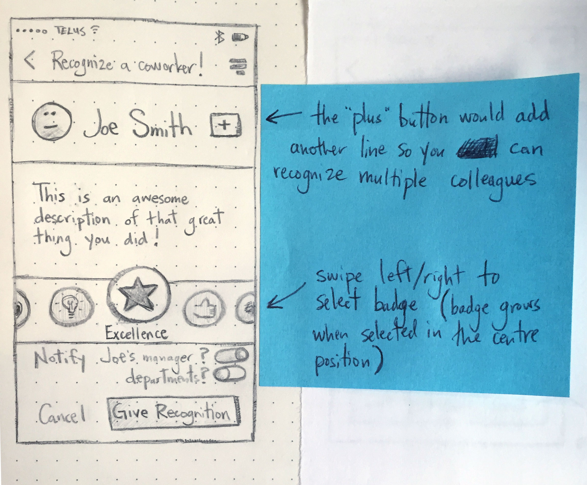
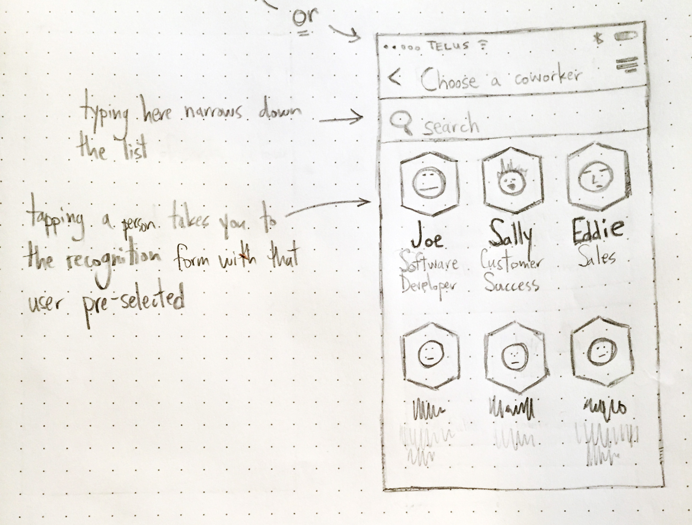

While there are debates around how a modern employee recognition program might operate, it's clear that there is tremendous value in being able to [recognize your colleagues](https://www.officevibe.com/facegame).
  
...
  
Seriously though, it's obvious that showing appreciation and receiving kudos from teammates builds morale and makes people feel more connected to each other.  But should it be a core focus of a company, or is it just an annoying thing aimed at 'millennials'?

#### The 7Geese flavour of ~~love~~ recognition

At 7Geese, recognition badges represent a company's core values; awarding badges to colleagues then helps strengthen each person's alignment to those values.

I love that simplicity.  It's also a really nice parallel to the way OKRs strengthen the alignment of everyone's goals.

#### What is recognition good for?

For many 7Geese users, being recognized by a co-worker is a ["magic moment"](http://genius.com/Alex-schultz-lecture-6-growth-annotated)– an instant where a user feels the platform delivering its core value and building its stickiness.

Since recognition can come from anyone (peers, managers, reports) it can help to unify teams, proactively reinforce good performance, and foster a sense of appreciation and belonging across the entire team.  New employees being on-boarded can quickly get a direct sense of what that company is about.  And the public nature of recognition means people are noticing that your work is getting noticed.

Zooming out a bit, the trend of recognition given over a period of time could be an interesting data point for company leaders to help gauge employees' alignment to the company's core values.

#### Arguments against recognition (...and way better counterarguments)

It's also important to define what recognition is **not**– _i.e._ it doesn't acknowledge any employee's tenure, metrics or stats related to their job (there are no leaderboards!), and it's not meant to gamify an employee's training experience (meaning, you don't get a 'prize' after each level), for example.

That being said, there are still a few arguments we've received against recognition's effectiveness.

The most reasonable one I've heard so far is that it can be annoying at larger companies to see a feed full of recognitions, some of which you may not care about.  There's likely a case to be made for allowing users to opt in/out of which recognitions hit their feed and, conversely, if employees wanted to be more private, and limit the publicity of recognitions they have received (even though that kind of defeats the purpose...).

Another complaint is that people are being recognized too frequently, and that it can feel like a bit of a popularity contest.  The answer to this could be as simple as teaching people to ask _"Is this something that could happen everyday?"_, and if the answer is _yes_, it's not recognition.  Recognition must me authentic and genuine, or else it's not worth the pixels on the screen.

I also think it'd be an interesting experiment to limit the frequency of recognitions– `more scarcity == more valuable`.  For example, maybe you can only give out 1 recognition per week, or only recognize one person per month.  The purpose wouldn't be to limit users, but just ensure some common sense guidelines were being followed.  The details would have to be worked out, but it might help people to give proper consideration before recognizing someone, and make recognitions harder to 'abuse'.

Finally, there's the argument that "I'm not a millennial, I don't need to be recognized for doing my job."  In my opinion, that's straight bull$h!t.  But don't take my word for it!  Harvard Medical School published an article a few years ago explaining how [gratitude helps people feel more positive emotions, relish good experiences, improve their health, deal with adversity, and build strong relationships](http://www.health.harvard.edu/newsletter_article/in-praise-of-gratitude).  And Harvard is never wrong, so...

#### Is mobile the right format?

Since our Q3 meeting, I've been interested in the idea of each module of 7Geese being its own mobile app.  It makes sense, since we have some customers who only use 7Geese for recognition, and I've read feedback from another customer who wants to use 7Geese only for doing his 1-on-1s.  We've also got an "OKR only" tier, so it makes sense that we'd have an OKR only app.

So let's think for a minute about why mobile would be a good format for an individual module like recognition.

In the simplest terms, the act of giving recognition is quick and easy to do.  It's an impulsive action that doesn't require any preparation.  I could be on the SkyTrain on my way home from the office and remember that I wanted to recognize a colleague.  I whip out my phone, and 💥.  That kind of ease and convenience would also facilitate timely recognition which, as we know, [(is more effective)](http://support.7geese.com/hc/en-us/articles/204411167-Tips-On-Recognizing-a-Teammate).

#### Some mobile best practices

Here are a few considerations when designing a mobile experience:
- elements should be sized appropriately
    - _design for fat fingers, pictorial icons_
- [use animations](http://tympanus.net/Development/CardExpansion/), maybe [SVG morphing icons](http://tympanus.net/Development/AnimatedSVGIcons/)?
    - **this is supposed to be fun!!**
- there might be better [alternatives to dropdowns](http://www.lukew.com/ff/entry.asp?1950)
- how does the navigation work?
- how many clicks/swipes are required to accomplish a certain task?
    - _[not that that matters?](http://uxmyths.com/post/654026581/myth-all-pages-should-be-accessible-in-3-clicks)_
- mobile internet is slow
    - is the app simple, and the payload to the browser as small as it can be?
- design patterns: [cards](https://blog.intercom.io/why-cards-are-the-future-of-the-web/) vs [grids](http://blog.uxpin.com/6774/5-creative-mobile-ui-patterns-navigation/) vs [lists](http://www.nngroup.com/articles/image-vs-list-mobile-navigation/)
- how much of the app can i navigate using only one hand?

#### Notes on some of the screens we'll need

1. login
2. navigation
    - I'm leaning towards a fullscreen nav motif throughout the app (i.e. popovers, dialogs, and navigation would all take up the full screen while they're being used)
3. browse colleagues
    - _also browse departments or teams?_
    - choosing a colleague then opens recognition form with the person pre-selected
4. recognition form (for giving recognition)
    - _recognize individuals, groups, and departments?_
    - choose user(s)
    - write description
    - choose badge
    - checkbox toggles: notify recipient's manager? department(s)?
5. list (feed) of recognition given out
    - _ability to filter by person / team / badge_
    - each list item links to individual recognition
    - ability to "like" or share without having to go to individual recognition (swipe left on iOS)
6. individual recognition pages
    - I imagine it would be really similar to the card-style layout we use for this already
    - _with comments_
    - _ability to "like"_
    - _social sharing (maybe admins can turn this off in settings)_
7. social sharing button's overlay/dialog (full screen)
8. list of available badges with descriptions
    - choosing a badge shows the description of that badge (full screen)
    - when in full screen, there's an 'x' to close the overlay, and a CTA button to give that badge to someone, which then opens the recognition form with that badge pre-selected
9. _Admins:_ create and edit badges
    - badge name
    - description of badge
    - which departments can use it?
    - upload an image
        - _by the way, Digital Ocean has [some really nicely designed core values badges](http://drbl.in/mZXI), worth checking out_

    _note:_ each rectangle in the wireframes below is the size of an iPhone 6 screen

    mobile interface for giving recognition

    giving a recognition, looking at a recognition, navigation, and social sharing

    3 possible UIs for choosing a coworker to recognize

