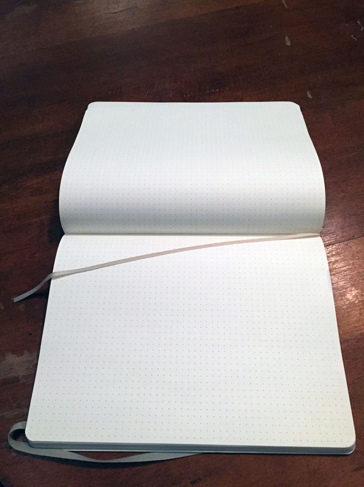

A user interface (UI) is the means by which humans interact with machines in a way that makes it easy, efficient, and enjoyable to operate those machines in a way that produces the desired results.
  
But how often do UIs completely under-deliver on that promise?

#### Pop UIs

Obviously, I <3 UIs.  At the same time, I think this quarter-century-old quote is as relevant as ever:

<blockquote>
    “The real problem with the interface is that it is an interface. Interfaces get in the way. I don’t want to focus my energies on an interface. I want to focus on the job…I don’t want to think of myself as using a computer, I want to think of myself as doing my job.” – [Donald Norman (circa 1990)](http://cs.nyu.edu/courses/spring98/G22.2280/UI-Introduction/sld072.htm)
</blockquote>

It's funny to think that 12 years later, **Minority Report (2002)** would come out and designers would immediately start spending [a lot of time trying to repackage Steven Spielberg’s vision of the future](http://www.theawl.com/2013/02/how-minority-report-trapped-us-in-a-world-of-bad-interfaces).

It's interesting to contrast that with the "slight future" world of **Her (2013)** released about a decade later, where UI is actually hard to find.  People talk to their computers (no fiddling with keyboards or touch screens). Theo's smart house turns its lights on/off as he moves between rooms, with no interface.

Another interesting design decision in **Her**, which makes for a great counterpoint to **Minority Report**, is that [instead of overlaying our vision with a feed, as we’ve typically seen it, Theo gets a one piped into his ear](http://www.wired.com/brandlab/2014/01/will-influential-ui-design-minority-report/).  I've been finding more, and more that the convention of "the feed" is being thought of as an anti-pattern, and according to some arguments, [antithetical to the true spirit of the internet](https://medium.com/matter/the-web-we-have-to-save-2eb1fe15a426).  Although, this is slightly ironic, considering a main concept of "the feed" is to deliver curated information to the end user.

#### The best interface is no interface

Lately, I've been thinking more about the 3 principles laid out by Golden Krishna, who is one of the larger proponents and champions of [the best interface is no interface](http://www.cooper.com/journal/2012/08/the-best-interface-is-no-interface) (in fact, he may have coined the phrase, I dunno).

**Note:** I say specifically that I like the _principles_ because the name of the theory is an obvious false dichotomy, and that's how flame wars that go nowhere get started. 🔥

At a high level, I interpret the principles to be asking, "What is the _minimum_ interface that a user needs?".

<blockquote>
    “Good design is invisible. Minimum input, maximum output, with minimal conscious thought.” — [Oliver Reichenstein](http://www.theverge.com/2012/7/24/3177332/ia-oliver-reichenstein-writer-interview-good-design-is-invisible)
</blockquote>
 

#### Principle 1: Embrace natural processes

According to this principle, you as a designer analyze the situation first and identify the processes that already exist around the problem you're trying to solve.  This is in contrast to saying, hey, I have all this great technology, now where can I apply it?

[Amazon Dash](http://techcrunch.com/gallery/what-its-like-to-use-amazons-new-dash-buttons/?ncid=rss) buttons are a really interesting example of offering a screenless solution to interact with their service.  It's funny that the idea was so outrageous that people thought it had to be an April Fool's joke.  But for realz, my washer/dryer doesn't need a screen and its own wifi connection where I need to log into my Amazon account and order more detergent.

The example Krishna uses of how [the BMW app](http://www.theverge.com/2015/3/17/8103593/golden-krishna-best-interface-is-no-interface-excerpt) gets it wrong is a great example of the flaws with having a technology-first approach.

He then outlines how he would apply the observational methods from his **Cat Poet** acronym to begin designing a screenless solution.

C. What is the typical **context** for the activity?

A. Who are the primary **actors**?

T. What’s the primary **task** or goal?

P. What’s the typical **process** you’d like to simplify?

O. What **objects** typically exist in the environment?

E. Does anything need to be **explained** or communicated to the person(s) involved?

T. What **triggers** might indicate that the person wants to commit to that action?

So, how would this look when applied to a problem we're trying to solve at 7Geese?

**Problem:** Help users **assess and check into their OKRs in 7Geese** by aggregating information from 3rd party project planning applications.

**Context**
- At the office or at home, on laptop/desktop computer

**Actors**
- employees, managers (could be further specified with personas)

**Task**
- checking into objectives (which also includes updating KRs and assessment updates)

**Process**
1. log into 7Geese and navigate to the objective that needs updated
2. gather information on how much progress has been made on an objective
3. enter a description/summary of what has happened
4. enter the specific numbers/details related to each KR
5. Assess OKR as "On/Off Track" and enter a status for the update (Max mentioned that there's an opportunity for combining this with step #2)
6. Save the check in so that it appears in 7Geese and notifies colleagues

**Objects**
- computer, desk, wifi, bluetooth, other software and devices

**Explained**
- the user needs to see the new state of their KRs (expressed as a ratio, percentage, dollar amount, or binary complete/incomplete)
- the user also needs to be shown their new overall progress percentage

**Triggers**
- the user has completed meaningful work in a 3rd party application such as Asana, Jira, or GitHub
- the owners/stakeholders of the objective are having a meeting
- the objective has been completed
- the quarter is ending

The context could likely be fleshed out even more, but I think that this kind of approach is one nice way to solve a problem by starting with people and working back to technology.

#### Principle 2: Leverage computers instead of catering to them

This is just a slightly fancier way of asking, "Who's in charge here?!"

Screens are needy.  You're stuck using them; it's a chore.  You have to swipe, click, tap your way to what you need. Sometimes it's necessary to interact with a screen, but other times you have to wonder...

I usually have my cell phone on ringer at home, and on vibrate when I'm out in the world– why doesn't my phone notice and ask me about it if I've forgotten to turn on vibrate after leaving the house?

When the title of one of my Calendar events contains the word "Meeting" and my status is "Show as Busy", why doesn't OS X turn on "Do Not Disturb" for me (or at least ask me)?

Speaking of calendars, this seems similar to what we're doing with 1-on-1 scheduling; just trying to make logical connections for users to reduce their cognitive overhead.  But we're really just scratching the surface.  OKR due dates could appear as calendar events, or cycle beginnings and endings (quarterly? triannually? etc.) could appear in calendars as well.

_Footnote:_ I'd say [machine learning](https://en.wikipedia.org/wiki/Machine_learning) falls under this principle as well, but that's a much bigger, much more complicated, much more expensive topic unto itself (which I know, like, nothing about).  [AirBnB's engineering team](http://nerds.airbnb.com/aerosolve/) posts some really cool stuff on the topic if you're interested, though.

#### Principle 3: Adapt to people

I find this principle especially interesting.  Krishna uses the example of thinking back to when you first signed up for Gmail– it was awesome, everything was new, powerful, innovative...but where can it go from there?  The only way to keep giving gains to the end user is to either build more features, or execute an expensive, time-consuming re-design every few quarters to keep things fresh.

Reversing this curve reveals a more human-centric outcome.  For example, Nest.  There's a shiny, conspicuous UI on Nest, for sure, but that's just the front door of the product.  Over time it can learn your behaviour and, in the case of Nest thermometers, can adjust themselves automatically based on your patterns. This creates more value the more you use the product by saving you time and money while keeping things at a comfortable temperature.  So, the UI becomes less necessary as time goes on.

At 7Geese we're starting to re-imagine how our notifications and information architecture operate.  How should our application talk to users?!

Using this principle as a guideline, I could imagine a time where 7Geese notices how a user likes to set their OKRs (i.e. maybe 3 OKRs every quarter), and prompts the user to engage with an [OKR builder](/articles/3-okr-builder-concept) a week before the current quarter ends, and save their OKRs as drafts that would then begin the following week.

Building off of that idea, I could also imagine 7Geese noticing the frequency that a user checks into each individual OKR, and again prompt the user to visit that OKR's page and take action.

I realize these last scenarios I've described rely on screens, but they speak directly to what I feel is a sister-principle at play here– reduce the cognitive load of the user so that I think of myself as "doing my job" and not "using a computer".

_The future is simpler than you think._

    below are the most elegant sketches of no ui you will never see

