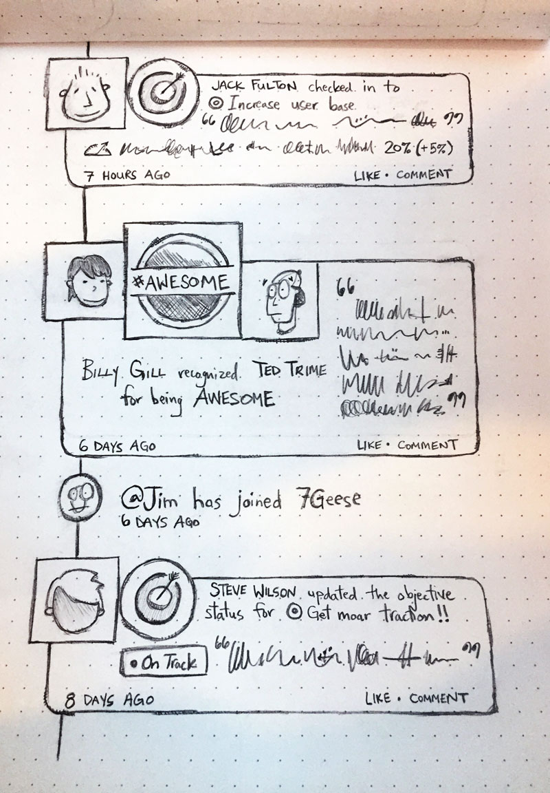
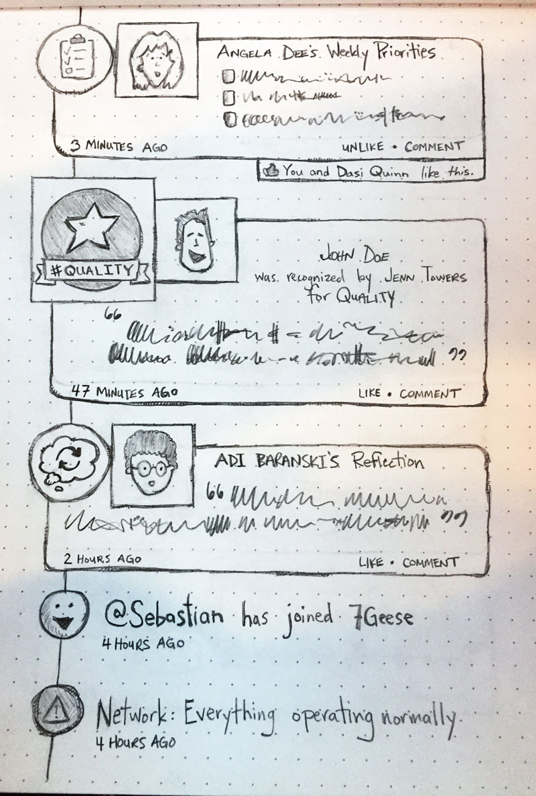
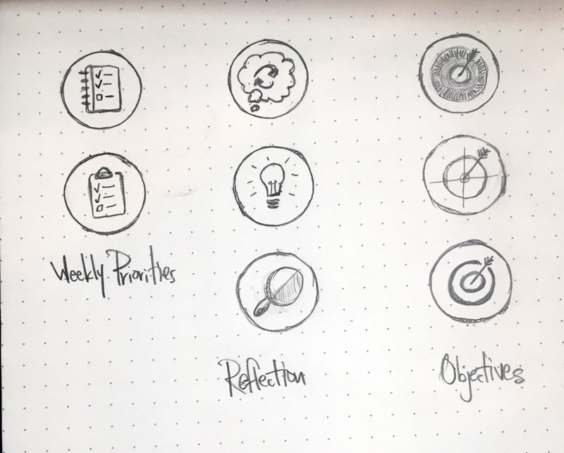
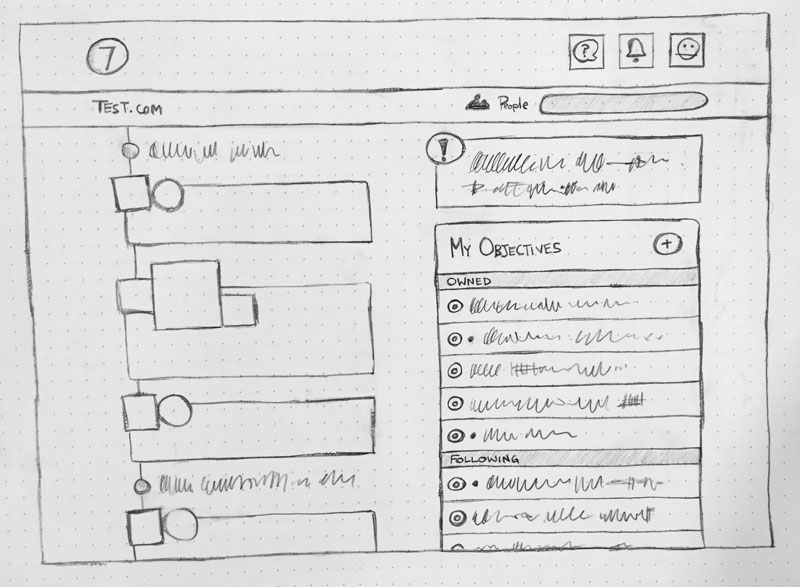

Last week, there was a thread on 7Geese where Amin revealed that there had been a time where the "Post" functionality for the Feed on the homepage was _almost_ removed completely because 7Geese's focus is not to be a communication portal like Yammer or Slack.
  
At first this caught me by surprise (not the product differentiation, the thought of removing the ability to "Post"), but I thought about it for a while and started to envision how that change might look.

#### The thought process

Essentially, I have two overarching thoughts that I'm combining into this particular design of the homepage feed:
1. If you scroll through your feed, you'll notice that (other than occasionally posting some meeting notes) we mainly use the "Post" functionality to enter **Weekly Priorities** and **Reflection** _(...I'm going to explore the idea of Reflection as its own module in next week's post...)_.  So, I'm imagining that those are two modules in 7Geese, similar to how Objectives, Recognitions, Feedback, and 1-on-1s are their own modules.
2. If feed items followed some sort of visual hierarchy, you'd be able to scan the feed more quickly and extract the information you need more easily _i.e._ less actionable updates would appear smaller, while more actionable or significant items would appear larger.

#### Visual hierarchy

To establish the foundation of a visual hierarchy, I'll start by defining the size of feed items in this new design to be one of three possible sizes: small, medium, or large.

**Small** feed items would be infrequent actions, or non-actionable pieces of information.  For example, network updates such as "<u>@John Smith</u> has joined 7Geese", or "<u>@Sally Jones</u> created a new department: Sales", would likely appear as small, one-line messages.  We could still include the user's avatar, and hyper-link their name, but that message would be visually deemphasized in the feed.  This also includes items that a user is not able to comment on.

**Medium** feed items could be thought of as semi-frequent actions that represent some kind of progress.  This kind of action could be checking into, assessing, or closing an objective.  Users would still be able to comment on these items from the feed.

I think Recognition is our only **Large** feed item at this time, but I wonder what other kinds of messages might warrant this level of emphasis in the feed – closing objectives comes to mind.

Basically, I'm envisioning something similar to GitHub's version of the feed as shown on a Pull Request page. In my opinion, that's the best representation of this kind of information I've seen in a user interface on the web.  If you know of an example that you think is amazingly designed, [let me know in the comments below](#disqus_thread)!

#### A quick note on functionality

Some functionality considerations that I'm not really going to explore in this post include:
- What kind of filtering do we want to keep/add/eliminate?
    + currently we can filter by People:
        * My Departments
        * My Direct Team
        * All Company
    + and by Item Type:
        * Posts
        * Objectives
            - when someone checks in
            - when an objective's status is updated, changed, or cleared
            - when a post is made on an objective
        * Recognition
            - when recognition is given/received
        * Network Updates
            - `@name` has joined 7Geese!
            - `@name` created a new department: Sales
- What kind of actions can a user take, and when?
    + here I'm referring to the ability to "Like", "Delete", "Comment", or "Edit" feed content
- Should we support Markdown?
    + of course I vote yes, but it's not a small integration since it would ideally require the ability to edit posts, a markdown preview-mode, user education, etc.
- Should we support uploading images in-line?
    + see sub-point above...

#### Item Types

It would be helpful and visually interesting to use an icon or symbol (more prominently than we do now) to represent the different item types that can possibly appear in the homepage feed.  Currently we have the 3 types listed above (when eliminating Posts), but just for fun I'm going to imagine that we also have a Weekly Priorities module and Reflection module – so that's **5 Item Types** in total:
- Objectives
- Recognition
- Weekly Priorities
- Reflection
- Network Updates

The crux of this design is that I'm proposing we eliminate the tabbed area (recognition/post) above the homepage feed, and the only messages that populate the homepage feed would come from 7Geese modules.  That being the case, users would still be able to comment on items in the feed as they currently do, and would still be able to "Post" on the objective page feed.

Have I missed anything important here?  Any holes in my pattern of thinking? [Leave a comment](#disqus_thread)!

    Idea #1 - a feed re-design with an emphasis on people (like the current feed)

    Idea #2 – emphasis on tasks

    icon brainstorming

    a lower fidelity view of how the new feed might fit into a different homepage layout

