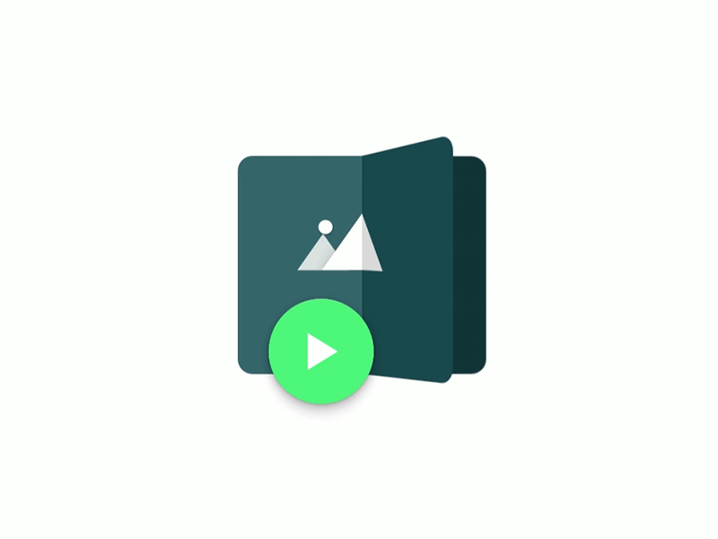
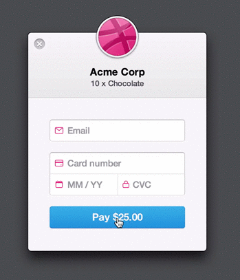

`/giphy awesome things`
 
Wondering what's going to pop up?!  Of course you are!  GIFs are awesome.  Movement is awesome. Motion is awesome.
  
You're awesome.  `/giphy high five`
 

#### Why Complicate UX with Frivolous UI Animations??!?

For starters, they're fun!!  A well-placed, tasteful animation can delight users, add to the stickiness of an application, and even help to express a brand's personality.

Of course there are more pragmatic reasons for animation as well.  A skillfully done animation can make an application appear faster.  Check out how the [Dribbbox](http://dribbbox.com/) homepage uses a bouncy animation of its name to distract you from the fact that the site is working in the background to retrieve a heavy payload of images (which then get used as part of the background design) using the Dribbble API.  This is a welcome alternative to the typically mundane loading GIF.  By the time the images load and fade in, the typical user would feel like they're getting a proper experience, and wouldn't know there was a delay at all!

<em style="font-size:11px;font-weight:200;color:#777;margin:15px 0 30px 0;display:block;">yaaaaaaaaaaaaaaawn...</em>

Another practical application of animation is to help maintain context for the user, and show the relationship between states as they change.  A great example is YouTube's current play/pause button.  Go ahead and give the play button a few clicks and watch the icon morph into a new shape, clearly leaving the user with an understanding of before/after.

<iframe width="560" height="315" src="https://www.youtube.com/embed/TWXZy2dOuBc?rel=0&amp;showinfo=0" frameborder="0" allowfullscreen></iframe>

Motion can also give the user reassuring feedback.  For example, Material Design and iOS both give the user feedback when something is tapped or clicked.  This is usually in the form of a subtle ripple and quick flash.  Showing cause and effect is an important factor in interaction design.  In the case of Material Design, the ripple originates from where the user taps or clicks on the element, as you can see here.

    <video autoplay loop tabindex="0" style="width:300px;">
        <source src="//material-design.storage.googleapis.com/publish/material_v_4/material_ext_publish/0B3T7oTWa3HiFOFFrMHpqN3NMQkU/animation_responsiveinteraction_userinput_materialresponse.webm" type="video/webm">
        <source src="//material-design.storage.googleapis.com/publish/material_v_4/material_ext_publish/0B3T7oTWa3HiFcDFYVWp0QUVGSEE/animation_responsiveinteraction_userinput_materialresponse.mp4" type="video/mp4">
        </video>
    <em style="font-size:11px;font-weight:200;color:#777;margin:15px 0 30px 0;display:block;">Material Design Response</em>

Finally, motion can help inform the visual hierarchy of a screen in an equally important way as the size and colour of elements.  Motion catches the eye and can draw a user's attention to that section of the screen.  Good examples of this are when items are animated-in as they're appended to a list, or when a numbers swells-in above a notifications icon to indicate unread messages.  Even a looping animation might be effective to highlight the next element that the user should (or even must) interact with.

Is there an amazing example of motion design in an app you've used, or someone's portfolio you've checked out before?  [Post a link!](#disqus_thread)

#### Be Careful!

A quick word from [Buzz Killington](https://youtu.be/HgY-xvyIlzY):

You need a license for these things!!  Not really, but they're easy to overdo.  The most pleasing and effective animations typically show a great deal of restraint and good taste.  They have to be applied consistently, just like any other enhancement, to avoid negatively surprising the user, or worse still, confusing them and putting them off task.

#### Read The Docs

Motion design existed well before the digital age, and even [thousands of years ago, depending who you ask](http://news.discovery.com/history/archaeology/prehistoric-movies-120608.htm).  But modern animation and motion design as we know it arguably began in the 1930s with Disney's [12 basic principles of animation](https://vimeo.com/93206523).  These principles are echoed and expanded upon for the digital age in Google's [Material Design Animation](https://www.google.com/design/spec/animation/responsive-interaction.html#responsive-interaction-user-input) docs and also Apple's [iOS Human Interface Guidelines](https://developer.apple.com/library/ios/documentation/UserExperience/Conceptual/MobileHIG/Animation.html#//apple_ref/doc/uid/TP40006556-CH57-SW1).  The fact that the two largest mobile platforms have documentation on how animations should be done is quite telling.  Although, while it's helpful to have these written guidelines, it's important to remember that, in the end, motion is one of those things that just has to _feel right_ and fit in the context it's used.

**A note on broswer support:** With our recent, unceremonious kicking of IE8 to the curb, we gain a lot more options for leveraging awesome, state-of-the-art web technologies to create animation!  There are still a number of challenges, but it helps.  🎉

#### Down Wit' OPP

While there are some [pretty](http://species-in-pieces.com/) [amazing](http://www.apple.com/ca/mac-pro/) [examples](http://codepen.io/juliangarnier/pen/idhuG) of [web-based](https://stripe.com/dashboard/iphone) [animations](https://developer.github.com/program/), I'd like to highlight a couple UI-specific animations that I really like:

 

This is [one example](https://dribbble.com/shots/2075475-KickMaterial-Kickstarter-Material-app-icon) of an animated app icon– in this case, for a fan-made Android Kickstarter app.  It's not _necessarily_ a piece of the UI, although it could be used in-app or on the homescreen of a mobile device.  Really, I think that creating an animated icon tailored for a specific app is just a cool opportunity to express the values and personality of a brand while showing off some design facility.

    
See the Pen <a href='http://codepen.io/suez/pen/oXLroX/'>Pull Down to Refresh (Paper Plane)</a> by Nikolay Talanov (<a href='http://codepen.io/suez'>@suez</a>) on <a href='http://codepen.io'>CodePen</a>.

    
</script>

[This airplane animation](https://www.materialup.com/blog/create-material-design-animation) falls squarely into the inspiration category for me.  What this design lacks in practicality it more than makes up for in its execution and fun, surprise factor.

 

The way Stripe handles [the error response on this form](https://medium.com/bridge-collection/improve-the-payment-experience-with-animations-3d1b0a9b810e) with an animation is really cool.  As they explain, they took an interaction that was frustrating users and facilitated the situation with motion.  It's like the form is shaking its head _no_.

#### Making 7Geese Move

Which parts of 7Geese could benefit from some kind of motion design? Another way of asking that question could be, which actions or tasks in 7Geese should _feel like more of an event_?

The application already has a nice animation when you update your progress; even hovering the key result progress percentage animates nicely into the "check-in" button.  But what else could be done?  Here's a short list of events in the app that could be enhanced by motion:

- checking into objectives (and updating assessments)
- closing objectives
- completing cycle requirements
- recognition (animated badges!?)
- when a list is filtered and items are added/removed (_i.e._ People Management page)
- when new messages appear at the top of the feed
- when new notifications are available (icon background colour and the number indicator in the nav bar)
- when modal dialogs appear/disappear
- _[some other idea you just thought of...](#disqus_thread)_

In **Part 2** I'll use [After Effects](http://www.adobe.com/ca/products/aftereffects.html) or maybe [Snap.svg](http://snapsvg.io/) to make one of these sketches move.  Also, I might need to do some consulting on the finer points of SVGs... Kevin Fales, I'm looking at you. 👀
 

    motion design concepts

